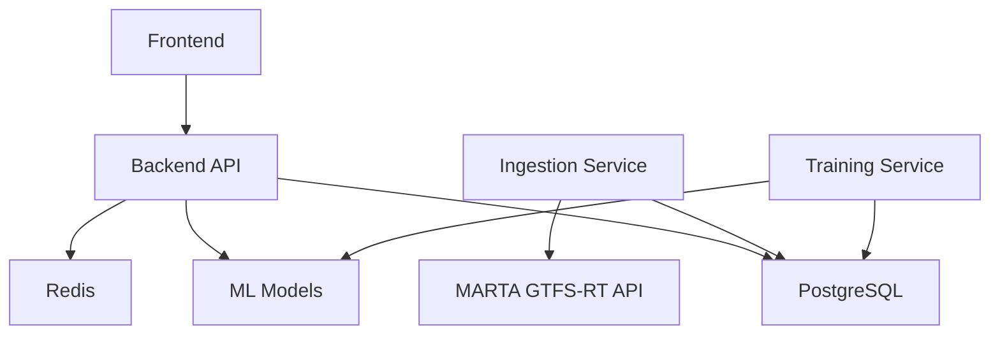

# MARTA Transit Platform - Architecture Review

**Review Date:** 2026-03-13
**Reviewer:** Architecture Audit System
**Version:** 1.0.0

---

## Executive Summary

The MARTA Transit Platform is a comprehensive transit analytics system featuring real-time data ingestion, demand forecasting, route optimization, and a modern React frontend. The architecture demonstrates solid foundational design but has several areas requiring attention for production readiness.

---

## 1. ML Pipeline Design

### 1.1 Model Architecture

**Severity: Medium**

The platform supports multiple model types:

| Model Type | Location | Purpose |
|------------|----------|---------|
| LSTM | `src/models/lstm_demand_forecaster.py` | Time-series demand prediction |
| XGBoost | `src/models/xgboost_demand_forecaster.py` | Gradient boosting predictions |
| Ensemble | `src/models/model_ensemble.py:94-113` | Combined model predictions |
| Attention LSTM | `src/ml_pipeline/models/attention_lstm.py` | Advanced sequence modeling |

**Findings:**

- **Critical (C-1):** Model versioning is implicit, relying on filesystem timestamps rather than explicit version tracking (`src/models/model_serving.py:477-483`)
- **High (H-1):** No model rollback mechanism exists; failed deployments require manual intervention
- **Medium (M-1):** Feature engineering is tightly coupled to specific models (`src/models/demand_forecaster.py:278-285`)
- **Medium (M-2):** Missing feature schema validation before inference (`src/models/model_serving.py:278-292`)

### 1.2 Experiment Tracking

**Severity: Medium**

MLflow integration exists (`src/models/ml_experiment_tracker.py`) but:
- Experiment comparison tools are limited
- No automated champion/challenger model selection
- Hyperparameter search results not persisted long-term

### 1.3 Model Serving Infrastructure

**Severity: High**

`src/models/model_serving.py:629-642`:
```python
# CORS allows all origins - security concern
app.add_middleware(
    CORSMiddleware,
    allow_origins=["*"],
    ...
)
```

**Issues:**
- **High (H-2):** Model serving API allows all CORS origins
- **High (H-3):** No model warm-up/pre-loading strategy for cold starts
- **Medium (M-3):** Thread pool executor limited to 4 workers (`src/models/model_serving.py:442`)

---

## 2. Data Flow Architecture

### 2.1 Ingestion Pipeline

```
MARTA GTFS-RT API
      |
      v
+---------------------+
| gtfs_realtime_      |  90-second polling interval
| ingestion.py        |  (src/data_ingestion/real_gtfs_realtime_ingestor.py:57)
+---------------------+
      |
      v
+---------------------+
| PostgreSQL          |  gtfs_vehicle_positions, gtfs_trip_updates
| (Raw Tables)        |
+---------------------+
      |
      v
+---------------------+
| unified_realtime_   |  Every 10 minutes (src/data_ingestion/
| data                |  real_gtfs_realtime_ingestor.py:409)
+---------------------+
      |
      v
+---------------------+
| feature_store       |  ML-ready features
+---------------------+
```

**Findings:**

- **High (H-4):** Ingestion polling interval (90s) may miss real-time updates; GTFS-RT best practice is 30s (`src/data_ingestion/real_gtfs_realtime_ingestor.py:57`)
- **Medium (M-4):** No dead-letter queue for failed ingestion records
- **Medium (M-5):** Weather data integration is fire-and-forget (`src/data_ingestion/weather_integration.py`)
- **Low (L-1):** Unified data creation runs on fixed 10-minute interval, not event-driven

### 2.2 Data Quality

**Severity: Medium**

Data quality monitoring exists (`src/pipeline/monitoring/data_quality_monitor.py`) but:
- No automated alerting on quality degradation
- Orphan record detection is reactive, not preventive
- Schema drift detection not implemented

---

## 3. Frontend-Backend Coupling

### 3.1 API Contract

**Severity: Medium**

The frontend uses a flexible API client (`frontend/src/lib/api-client.ts`) with:
- Automatic timeout handling
- Error standardization via `ApiError` class

**Findings:**

- **High (H-5):** No API versioning strategy; breaking changes will affect all clients
- **Medium (M-6):** Frontend hardcodes API paths (`frontend/src/config/api.ts`) - should use API discovery
- **Medium (M-7):** No request retry logic with exponential backoff
- **Low (L-2):** Missing request deduplication for rapid user actions

### 3.2 State Management

`frontend/src/store/index.ts` uses Zustand for state management:

**Issues:**
- **Medium (M-8):** Global state includes server-side data that should be cached via React Query
- **Low (L-3):** No optimistic updates for user actions

### 3.3 WebSocket Architecture

`backend/api/routers/realtime.py:33-70`:
```python
class ConnectionManager:
    def __init__(self):
        self.active_connections: dict[str, Set[WebSocket]] = {}
```

**Findings:**

- **Critical (C-2):** WebSocket connections not authenticated (`backend/api/routers/realtime.py:316-330`)
- **High (H-6):** In-memory connection state; horizontal scaling will break WebSocket sessions
- **Medium (M-9):** No connection limit per client
- **Medium (M-10):** Missing heartbeat mechanism relies on 30s timeout (`backend/api/routers/realtime.py:343-345`)

---

## 4. Database Schema Analysis

### 4.1 Schema Design

`database/schema.sql` and `database/real_marta_schema.sql`:

**Findings:**

- **High (H-7):** No table partitioning for time-series data (`unified_realtime_historical_data`); will cause performance issues at scale
- **Medium (M-11):** UUID primary keys generate random I/O patterns; consider ULID for time-ordered inserts
- **Medium (M-12):** Missing composite indexes for common query patterns (route_id + timestamp)
- **Low (L-4):** `JSONB` column (`impact_metrics` in `route_optimization_results`) lacks GIN index

### 4.2 Materialized Views

`database/enhanced_materialized_views.sql`:

**Findings:**

- **High (H-8):** No refresh scheduling for materialized views; data becomes stale
- **Medium (M-13):** Concurrent refresh not enabled for all views
- **Low (L-5):** View dependencies not documented

### 4.3 Connection Pooling

`backend/api/services/database.py:26-33`:
```python
engine = create_engine(
    settings.database_url_computed,
    pool_size=settings.db_pool_size,        # Default: 10
    max_overflow=settings.db_max_overflow,  # Default: 20
    pool_timeout=settings.db_pool_timeout,  # Default: 30
)
```

**Issues:**
- **Medium (M-14):** Pool size (10+20=30) may be insufficient for production traffic
- **Low (L-6):** No connection pool metrics exposed

---

## 5. Route Optimization System

### 5.1 Optimization Engine

`src/optimization/route_optimizer.py`:

**Architecture:**
- Uses demand and dwell-time models for prediction
- Supports headway and short-turn optimization
- Results persisted as `.pkl` files

**Findings:**

- **High (H-9):** Optimization results stored as pickle files on local filesystem (`src/optimization/optimization_orchestrator.py:195-210`)
- **Medium (M-15):** No optimization job queue; concurrent requests may interfere
- **Medium (M-16):** Constraint validation happens at runtime, not schema level
- **Low (L-7):** Historical optimization results not queryable via API

### 5.2 Stored Procedures

`database/stored_procedures.sql`:

Well-designed procedures for:
- `get_current_vehicle_positions` (lines 9-62)
- `get_stop_arrivals` (lines 65-147)
- `get_demand_forecast` (lines 154-223)
- `get_nearby_stops` (lines 400-453)

**Findings:**

- **Low (L-8):** Some procedures use dynamic SQL with `EXECUTE format()` (`stored_procedures.sql:537-538`) - validated inputs only

---

## 6. Migration Strategy

### 6.1 Current State

`migrations/env.py` and `migrations/versions/001_initial_migration.py`:

**Findings:**

- **High (H-10):** Only one migration file exists; schema changes are applied directly
- **Medium (M-17):** No rollback scripts for migrations
- **Medium (M-18):** Missing data migration strategy for schema changes
- **Low (L-9):** Alembic not fully configured for async operations

---

## 7. Scalability Assessment

### 7.1 Horizontal Scaling

**Current Limitations:**

| Component | Limitation | Impact |
|-----------|------------|--------|
| WebSocket | In-memory state | Single instance only |
| Model Cache | Local memory | Cache duplication |
| File Storage | Local disk | No shared access |
| Session State | No Redis integration | Auth issues |

### 7.2 Vertical Scaling

`docker-compose.yml`:

**Findings:**

- **Critical (C-3):** No resource limits defined for containers
- **High (H-11):** Grafana password hardcoded (`GF_SECURITY_ADMIN_PASSWORD=admin`, line 249)
- **Medium (M-19):** No container orchestration (Kubernetes) configuration

### 7.3 Bottlenecks

1. **Database Writes:** Unified data table receives high write volume
2. **Model Inference:** Single-threaded model loading
3. **GTFS Polling:** Synchronous HTTP requests block ingestion

---

## 8. Service Dependencies



**Critical Dependencies:**
- PostgreSQL: Single point of failure
- MARTA API: External dependency with no circuit breaker

---

## 9. Prioritized Action Plan

### Immediate (P0) - Week 1

1. **[C-1]** Implement model versioning with MLflow registry
2. **[C-2]** Add WebSocket authentication middleware
3. **[C-3]** Define Docker resource limits

### High Priority (P1) - Weeks 2-4

4. **[H-2]** Restrict model serving CORS origins
5. **[H-4]** Reduce GTFS polling interval to 30 seconds
6. **[H-5]** Implement API versioning (/api/v1/, /api/v2/)
7. **[H-6]** Implement Redis-backed WebSocket state
8. **[H-7]** Add time-based partitioning for historical data
9. **[H-10]** Establish proper migration workflow

### Medium Priority (P2) - Weeks 5-8

10. **[M-1]** Decouple feature engineering into reusable pipeline
11. **[M-4]** Implement dead-letter queue for ingestion failures
12. **[M-15]** Add job queue (Celery/RQ) for optimization requests
13. **[M-17]** Create rollback scripts for all migrations
14. **[M-19]** Create Kubernetes deployment manifests

### Low Priority (P3) - Ongoing

15. **[L-1]** Event-driven unified data updates
16. **[L-6]** Expose connection pool metrics to Prometheus
17. **[L-8]** Audit dynamic SQL for injection vectors

---

## Appendix A: File Reference Index

| Finding | Primary File | Line Numbers |
|---------|--------------|--------------|
| C-1 | src/models/model_serving.py | 477-483 |
| C-2 | backend/api/routers/realtime.py | 316-330 |
| C-3 | docker-compose.yml | 1-270 |
| H-1 | src/models/model_serving.py | 446-507 |
| H-2 | src/models/model_serving.py | 636-642 |
| H-4 | src/data_ingestion/real_gtfs_realtime_ingestor.py | 57 |
| H-7 | database/schema.sql | 89-119 |
| H-10 | migrations/versions/001_initial_migration.py | all |
| H-11 | docker-compose.yml | 249 |

---

*End of Architecture Review*
