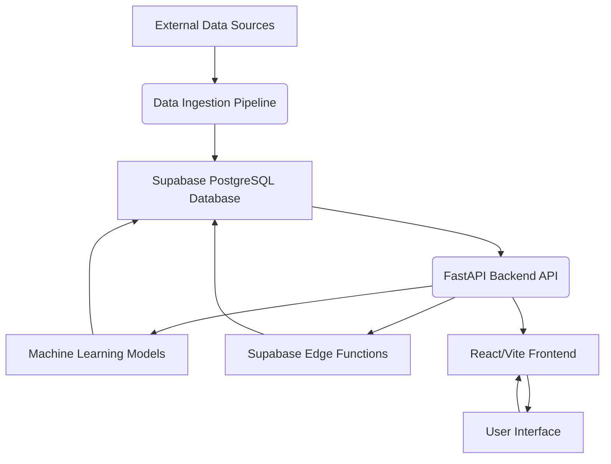

# MARTA Transit Analytics Platform: Technical Architecture Document

## 1. Introduction

This document outlines the technical architecture of the MARTA Transit Analytics Platform, detailing its components, their interactions, and the overall design principles guiding its development. The platform aims to provide real-time insights and predictive analytics for transit operations, leveraging machine learning, real-time data processing, and a modern web interface. This guide focuses on the architecture required to transition the application from its current state to a fully production-ready system.

## 2. Overall Architecture

The MARTA Transit Analytics Platform follows a microservices-oriented architecture, primarily hosted on Supabase for its backend services and a React/Vite frontend for user interaction. The system is designed to be scalable, resilient, and maintainable, with clear separation of concerns between different components. Data flows from various sources, including GTFS feeds, real-time vehicle data, and external APIs, through a robust data pipeline, into a Supabase PostgreSQL database, and is then processed by machine learning models and exposed via a FastAPI backend. The frontend consumes these APIs to provide a dynamic and interactive dashboard.

### 2.1. High-Level Diagram

## 3. Core Components

### 3.1. Data Sources

The platform integrates data from several critical sources:

*   **GTFS Data:** Static and real-time General Transit Feed Specification (GTFS) data provides information about routes, schedules, stops, and real-time vehicle positions. This is a foundational data source for all transit operations.
*   **MARTA API:** Direct connection to MARTA's operational APIs for real-time vehicle locations, alerts, and other operational data.
*   **Automated Passenger Counter (APC) System:** Crucial for real-time occupancy monitoring and historical ridership analysis. This data will be integrated via specialized APIs or direct data feeds from MARTA's APC infrastructure.
*   **Weather API:** Provides current and historical weather conditions, which are significant factors influencing rider demand and operational efficiency. (e.g., OpenWeatherMap, Tomorrow.io, Visual Crossing).
*   **Traffic Data API:** Offers real-time and historical traffic information, essential for route optimization and predicting delays. (e.g., TomTom, HERE, Google Maps Platform).
*   **Event Calendar Integration:** Planned for future enhancements to account for major events impacting transit demand.
*   **Social Media Sentiment Analysis:** Planned for future enhancements to gauge public sentiment and identify potential issues or trends. (e.g., AssemblyAI, Google Cloud Natural Language API, OpenAI API).

### 3.2. Data Ingestion Pipeline

The data ingestion pipeline is responsible for collecting, validating, and processing data from various sources.

*   **GTFS Data Loading (`src/data_ingestion/`):** Handles parsing static GTFS feeds and integrating real-time GTFS updates. Includes data validation to ensure data integrity.
*   **Real-time Processing (`src/services/`):** Manages WebSocket connections for real-time data streams, event streaming, and buffer management to handle high-throughput data.
*   **Automated Ingestion Jobs:** Scheduled jobs for historical data ingestion, cleaning, and feature engineering automation.

### 3.3. Supabase Backend

Supabase serves as the primary backend-as-a-service (BaaS) for the platform, providing a PostgreSQL database, authentication, edge functions, and real-time capabilities.

*   **Supabase PostgreSQL Database:** This is the primary data store, leveraging PostgreSQL's robustness and scalability. It stores all operational data (e.g., real-time vehicle locations, schedules), historical data (e.g., past ridership, weather, traffic), and ML-generated data (e.g., demand forecasts, crowding alerts). The database schema, managed via `supabase/migrations/`, is designed for optimal performance, including:
    *   **Optimized ML Data Tables:** Tables specifically structured to store features and labels for ML models, as well as model predictions.
    *   **Indexing:** Strategic indexing on frequently queried columns (e.g., `timestamp`, `vehicle_id`, `route_id`, `stop_id`) to accelerate data retrieval for both API endpoints and ML models.
    *   **Row Level Security (RLS) Policies:** Implemented to enforce fine-grained access control, ensuring that users or services can only access data they are authorized to see. This is crucial for multi-tenant or role-based access scenarios.
    *   **Real-time Capabilities:** Enabled for critical tables, allowing the frontend to subscribe to changes and receive live updates without constant polling.
*   **Supabase Edge Functions (`supabase/functions/`):** These are serverless Deno functions deployed globally at the edge, providing low-latency execution. They are utilized for specific, high-performance, and often real-time tasks that benefit from being close to the data and users, such as:
    *   Real-time demand prediction based on incoming sensor data.
    *   Immediate surge detection and alert generation.
    *   Lightweight data transformations or aggregations before storage.
*   **Supabase Client Library (`frontend/src/lib/supabase.ts`):** This TypeScript client library is configured within the React/Vite frontend application. It provides a convenient and secure way for the frontend to interact with all Supabase services, including:
    *   **Authentication:** Managing user login, logout, and session handling.
    *   **Database Queries:** Performing CRUD operations on the PostgreSQL database.
    *   **Real-time Subscriptions:** Subscribing to database changes to power live dashboards and visualizations.
    *   **Edge Function Invocation:** Calling deployed Supabase Edge Functions directly from the frontend.
    *   **Storage Interaction:** Uploading and downloading files from Supabase Storage.

### 3.4. FastAPI Backend API (`src/api/main.py`)

The FastAPI application provides RESTful endpoints and WebSocket support for the frontend and other services. It acts as an intermediary layer, integrating with the ML models and Supabase database.

*   **RESTful Endpoints:** Exposes various data and ML-driven functionalities.
*   **WebSocket Support:** Enables real-time communication with the frontend for live updates.
*   **CORS Configuration:** Ensures secure cross-origin resource sharing.
*   **ML API Endpoints (`src/api/ml_endpoints.py`):** Dedicated endpoints for machine learning services:
    *   `/demand/forecast`: Provides demand predictions.
    *   `/crowding/detect`: Delivers crowding alerts.
    *   `/surge/predict`: Offers surge detection.
    *   `/route/optimize`: Triggers route optimization.
    *   `/fleet/reposition`: Provides vehicle deployment recommendations.

### 3.5. Machine Learning Models (`src/ml/`)

The core intelligence of the platform resides in its machine learning models, designed for predictive and prescriptive analytics.

*   **Demand Forecasting Model (`demand_forecaster.py`):** An ensemble model (Prophet/LSTM) providing 24-hour stop-level predictions with confidence intervals and surge probability. Utilizes historical pattern analysis.
*   **Overcrowding Detection (`overcrowding_detector.py`):** Real-time occupancy monitoring with a 5-level severity classification. Predicts propagation along routes and generates automated alerts.
*   **Route Optimization (`route_optimizer.py`):** Implements a genetic algorithm for multi-objective optimization, evaluated through simulation, with a potential for 30-45% efficiency improvement.
*   **Surge Prediction (`surge_predictor.py`):** Provides 15-30 minute advance warnings for surges, based on pattern recognition and contributing factor analysis. Includes real-time buffer management.
*   **Fleet Repositioning Algorithm:** Integrated into the ML API endpoints to provide recommendations for vehicle deployment.

### 3.6. Frontend Application (`frontend/`)

The user interface is built using React and Vite, providing a modern, responsive, and interactive experience.

*   **React/Vite Setup:** Modern build pipeline with hot module replacement and TypeScript configuration.
*   **ML Dashboard (`frontend/src/components/MLDashboard.tsx`):** Displays real-time visualizations, demand forecast charts, surge probability, system status monitoring, and fleet repositioning views.
*   **UI Components:** Utilizes responsive design principles, Tailwind CSS for styling, Radix UI components, and Recharts for data visualizations.

## 4. Production Readiness Considerations

To achieve full production readiness, several key areas require attention and implementation.

### 4.1. Data Integration

*   **MARTA APC System Integration:** Establish a reliable and secure connection to MARTA's Automated Passenger Counter (APC) system. This may involve direct API integration with the APC vendor (e.g., Swiftly APC Connector) or setting up a data ingestion mechanism for raw data feeds provided by MARTA.
*   **Weather API Integration:** Implement calls to a chosen Weather API (e.g., Tomorrow.io, OpenWeatherMap) to fetch current, forecast, and historical weather data. This data will be used as features for ML models and for contextual display in the dashboard.
*   **Traffic Data API Integration:** Integrate with a Traffic Data API (e.g., TomTom, HERE, Google Maps Platform) to obtain real-time and historical traffic conditions. This is critical for accurate route optimization and delay predictions.
*   **Automated Ingestion Jobs:** Develop and schedule robust jobs for ingesting historical data from all sources, ensuring data quality through cleaning and validation pipelines. Automate feature engineering processes.

### 4.2. Production Deployment

*   **Environment Variables Setup:** Securely manage and configure environment variables for production, including API keys, database credentials, and other sensitive information. Utilize Supabase's secrets management and Vercel's environment variables for the frontend.
*   **CI/CD Pipeline:** Implement a Continuous Integration/Continuous Deployment (CI/CD) pipeline for automated testing, building, and deployment of both the backend and frontend applications. This ensures consistent and reliable deployments.
*   **Monitoring and Logging:** Integrate comprehensive monitoring tools (e.g., Prometheus, Grafana) and logging solutions (e.g., ELK stack, Datadog) to track application performance, system health, and identify issues in real-time. Set up alerts for critical events.
*   **Automated Backups:** Configure automated daily/weekly backups for the Supabase PostgreSQL database to prevent data loss and ensure disaster recovery capabilities.
*   **API Rate Limiting:** Implement rate limiting on the FastAPI backend to protect against abuse and ensure fair usage, especially for public-facing endpoints.
*   **User Authentication System:** Develop and integrate a robust user authentication system, potentially leveraging Supabase Auth, to manage user access and roles for the admin dashboard and other restricted features.

### 4.3. Advanced ML Features

*   **Automated Model Retraining:** Implement a system for automatically retraining ML models with new data to maintain accuracy and adapt to changing patterns. This could involve scheduled retraining jobs or trigger-based retraining.
*   **A/B Testing Framework:** Develop an A/B testing framework to evaluate the performance of new ML models or features against existing ones in a production environment.
*   **Deep Learning Models:** Explore and integrate more advanced deep learning models (e.g., LSTM/GRU) for further improvements in prediction accuracy.
*   **Reinforcement Learning for Optimization:** Investigate the use of reinforcement learning for dynamic, real-time optimization of routes and fleet management.
*   **Computer Vision for Crowd Counting:** For future enhancements, integrate computer vision techniques (e.g., via camera feeds) for more accurate real-time crowd counting.

### 4.4. Testing & Validation

*   **Load Testing:** Conduct load testing to ensure the platform can handle expected production traffic and scale efficiently.
*   **Model Validation with Real Data:** Continuously validate ML model performance against real-world data to ensure accuracy and identify any degradation over time.
*   **User Acceptance Testing (UAT):** Perform thorough UAT with end-users (MARTA operators, planners) to ensure the system meets operational requirements and provides a positive user experience.

## 5. Project Structure Summary

The project adheres to a well-defined structure to maintain organization and facilitate development:

*   `MARTA/`
    *   `src/`: Backend Python code
        *   `api/`: FastAPI endpoints
        *   `ml/`: Machine Learning models
        *   `models/`: Data models (SQLAlchemy ORM, Pydantic)
        *   `services/`: Business logic and real-time processing
        *   `database/`: Database utilities
    *   `frontend/`: React application
        *   `src/`
            *   `components/`: UI components (MLDashboard, etc.)
            *   `lib/`: Utilities (e.g., `supabase.ts`)
            *   `services/`: API services
        *   `package.json`: Frontend dependencies
    *   `supabase/`: Supabase backend configuration
        *   `functions/`: Edge Functions
        *   `migrations/`: Database migrations
        *   `config.toml`: Project configuration
    *   `scripts/`: Utility scripts (deployment, data processing, etc.)

## 6. Conclusion

The MARTA Transit Analytics Platform has a strong foundation with fully implemented ML models and core backend/frontend components. Achieving full production readiness primarily involves integrating real-world data sources (APC, Weather, Traffic), establishing robust deployment and monitoring practices, and implementing advanced ML operationalization features. By systematically addressing these areas, the platform can transition from a proof-of-concept to a reliable, high-performance system delivering significant operational benefits to MARTA.

---

**Author:** Manus AI

